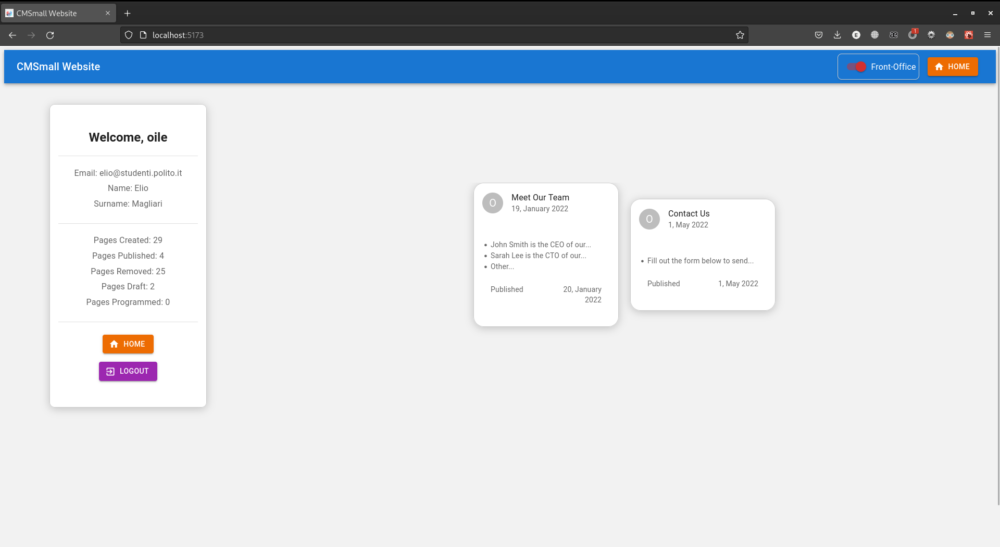

# Exam #1: "CMSmall"
### Student: Magliari Anuar Elio
### Teacher: Masala Enrico
### Grade: 30 and honours
### Politecnico di Torino

#

## Requirements

Design and implement a web application to manage a small content management system (CMS) with a minimal set of features. The application must meet the following requirements.

The CMS has a "back-office" (i.e., administrative and management area) and a "front-office" (i.e., the part of the web application visible publicly to everyone, without authentication).

In the back-office, the CMS allows authenticated users to create and manage content (i.e., pages). Each page has the following properties:

- A title;
- An author (by default, the logged-in user);
- A creation date, i.e., when it was created;
- A publication date. Depending on the value of this date, the page can be "draft" (publication date absent), "scheduled" (publication date is in the future), "published" (publication date is today or in the past);
- Content blocks.

A content block can be of three types: header, paragraph, or image. A page must have at least one header and one of the other two types of blocks. Images must be selectable from a list of pre-loaded images (there must be at least 4 images available). Blocks can be reordered during page creation and editing (as specified below). Headers and paragraphs must contain text.

After logging in, each authenticated user can see all pages created (by any author) on a dedicated screen, with the ability to:

- Create a new page, entering all necessary properties and adding at least one header block and at least one of the other blocks inside the page. The creation date and author cannot be changed. Blocks can be reordered at any time within the page during the creation process. How the sorting mechanism should work is left to the student (e.g., arrow keys to move blocks up and down). Blocks can also be removed during the page creation process.
- Edit an existing page of which they are the author. By editing the page, the authenticated user can change all properties (except the creation date and author within the page) and content (including adding, removing, and changing block order), but there must always be at least one header and one other type of block.
- Delete a page of which they are the author.

The CMS supports a special type of authenticated user, who has the role of administrator of the entire application. There is no limit to the number of administrators that can be present in the CMS. Any administrator can perform the operations of an authenticated user and in addition can:

- Edit or delete any page, even if the user is not the author.
- Change the author of a page by setting it to a different user.
- Set the name of the website, which must be displayed at the top of every screen (both in the back-office and front-office).

In the front-office, both authenticated and anonymous users will see the entire website, with the defined name, the list of published pages ordered chronologically by publication date, and can view all content of each page, including its properties.

The organization of the features in this text into different screens (and potentially different routes) is left to the student and is subject to evaluation.

#

## React Client Application Routes

- Route `/`: This is the home page of the website. It displays a list of all the available pages in the system. This route is accessible to all users, including anonymous users.
- Route `/pages/:id`: This route displays a detailed view of a specific page, identified by its id parameter. It shows all the contents of the page, including images and text. This route is accessible to all users, including anonymous users.
- Route `/pages/add`: This route allows a user to add a new page to the system. It displays a form where the user can enter the details of the new page, including the page title, release date, and contents. This route is only accessible to authenticated users.
- Route `/pages/:id/edit`: This route allows a user to edit an existing page in the system, identified by its id parameter. It displays a form prepopulated with the existing page details, which the user can modify and then save. This route is only accessible to authenticated users.
- Route `/login`: This route displays a login form where a user can enter their username and password to authenticate themselves in the system. If the user is already authenticated, they will be redirected to the home page. This route is accessible to all users, including authenticated users.
- Route `*`: This is the catch-all route, which is triggered when a user tries to access a route that does not exist in the system. It displays a "page not found" message and a link to the home page. This route is accessible to all users, including anonymous users.

#

## API Server

- GET `/api/pages`
  - Request Parameters: None
  - Response Body Content: This request retrieves all available pages. It is an open endpoint, accessible to unauthenticated users. The response includes a list of pages with their details, such as title, release date, content, and more.

- GET `/api/images`:
  - Request Parameters: None
  - Response Body Content: This request retrieves all available image paths. It is an open endpoint, accessible to unauthenticated users. The response includes a list of image paths present in the system.

- GET `/api/pages/:id`:
  - Request Parameters: ID (required) - The ID of the specific page to retrieve.
  - Response Body Content: This request retrieves a specific page based on the provided ID parameter. The endpoint is open and can be accessed by unauthenticated users. The response includes the details of the page corresponding to the specified ID.

- POST `/api/pages`:
  - Request Parameters: None
  - Request Body Content: This request allows adding a new page. Authentication is required to access this endpoint. The request must include a title and a content block. Some validation checks are performed before creating the page in the database.
  - Response Body Content: Upon successful creation, the response may include information about the newly created page.

- PUT `/api/pages/:id`:
  - Request Parameters: ID (required) - The ID of the page to be modified.
  - Request Body Content: This request allows modifying an existing page. User authentication and the ID of the page to be modified are required. The request must include a title and a content block. Authorization is performed to verify if the authenticated user is the author of the page or an administrator. Some validation checks are also performed before making the changes in the database.
  - Response Body Content: Upon successful modification, the response may include information about the updated page.

- DELETE `/api/pages/:id`:
  - Request Parameters: ID (required) - The ID of the page to be deleted.
  - Request Body Content: None
  - Response Body Content: This request allows deleting an existing page. User authentication and the ID of the page to be deleted are required. Authorization is performed to verify if the authenticated user is the author of the page or an administrator. The page is then deleted from the database.

- POST `/api/session`:
  - Request Parameters: None
  - Request Body Content: This request allows logging in and authenticating. It requires a valid email address and password. Validation checks are performed to verify the user's login credentials.
  - Response Body Content: If authentication is successful, information about the authenticated user is returned.

- DELETE `/api/session`:
  - Request Parameters: None
  - Request Body Content: None
  - Response Body Content: This request allows logging out and terminating the authenticated user's session.

- GET `/api/websitename`:
  - Request Parameters: None
  - Response Body Content: This request retrieves the website name. It is an open endpoint, accessible to unauthenticated users. The response includes the current website name.

- PUT `/api/websitename`:
  - Request Parameters: None
  - Request Body Content: This request allows modifying the website name. Authentication by an administrator is required. The request must include the new website name. A validation check is performed before making the modification in the database.
  - Response Body Content: Upon successful modification, the response may include information about the updated website name.

- GET `/api/session/current`:
  - Request Parameters: None
  - Response Body Content: This request allows checking if the user is authenticated and returns their information. User authentication is required, and the response includes the details of the current authenticated user.

- GET `/api/users`:
  - Request Parameters: None
  - Response Body Content: This request retrieves all users from the system. It is an open endpoint, accessible to unauthenticated users. The response includes a list of all registered users in the system.

#

## Database Tables

### The database is presented according to this logical scheme:

&#x2003; <!--  empty space -->
 
*Table `User`* - contains all information related to the system users
- `id` - unique identifier within the `User` table
- `email` - user's email
- `hash` - hash of the user's password
- `salt` - salt used for password hashing
- `username` - user's username
- `name` - user's first name
- `surname` - user's last name
- `role` - user's role in the system (regular user, administrator)

*Table `Page`* - contains all pages published by users
- `id` - unique identifier of a page in the `Page` table
- `title` - title of the page
- `release_date` - date when the page was published
- `creation_date` - date when the page was created
- `deleted` - logical deletion of the page; the page remains saved in the database but is logically deleted with this attribute set to "true"
- `user_id` - identifier of the user who created the page (page author)

*Table `Content`* - contains all content blocks related to pages created by users
- `id` - identifier of the content block associated with a page
- `header` - header of the content block
- `paragraph` - paragraph of the content block; it's optional
- `sort_number` - sorting number in the list of page blocks to which it refers
- `page_id` - identifier of the page to which the content is associated
- `image_id` - identifier of the image referred to by the content block, selected by the page author or an administrator
    - depending on the selection between paragraph or image, one of the two attributes ("paragraph" or "image_id") will be filled in according to the specifications

*Table `Image`* - contains all images that can be inserted into a content block of a page
- `id` - unique identifier of the image in the `Image` table
- `src` - path containing where to find the image in the filesystem
- `alt` - description of the image
- `title` - title of the image
- `website_name` - name of the website defined by an administrator

#

## Main React Components

- `Main` (in `App.jsx`): The main component responsible for rendering the overall application layout and managing the routing between different views.
- `AddPageView` (in `AddPageView.jsx`): A page component that handles the addition of new pages. It provides a form or interface for users to input the necessary details and create a new page.
- `EditPageView` (in `EditPageView.jsx`): A component that allows users to edit an existing page. It provides a form or interface pre-filled with the current page details, allowing users to make modifications and update the page.
- `GeneralPageView` (in `GeneralPageView.jsx`): A reusable component utilized by AddPageView, EditPageView, and PageView. Each of these views utilizes GeneralPageView for different purposes, enabling or disabling certain fields based on the context.
- `CardPageAddList` (in `GeneralPageView.jsx`): A component that takes a list of pages and calls CardPageAdd for each page, generating a list of page cards with add functionality.
- `CardPageAdd` (in `GeneralPageView.jsx`): A component that displays the details of a specific page in the form of a card. It may include options or actions related to adding the page.
- `HomePageView` (in `HomePageView.jsx`): A component responsible for rendering the home page. It may display an overview of various pages or provide navigation to different sections of the application.
- `LeftCardView` (in `LeftCardView.jsx`): A component shown on the left side of the display, containing brief information about the logged-in user. When in reading mode on a page, it displays details about the user associated with that page.
- `LoginFormView` (in `LoginFormView.jsx`): A component handling the login functionality. It provides a form or interface for users to enter their credentials and authenticate themselves.
- `PageTable` (in `PageTable.jsx`): A component that creates a table of card views representing pages. Typically used on the home page, it presents an organized view of multiple pages.
- `PageCard` (in `PageTable.jsx`): A component that displays the details of a page in the form of a card within the PageTable. It may include actions or options specific to that page.
- `PageView` (in `PageView.jsx`): A component that allows access to a dedicated web page for viewing a specific page. It provides a detailed and interactive representation of the page content.

## Screenshot

- Home page of an authenticated user in front user mode:
  

- Home page of an unauthenticated user in front user mode:
  

- Login page:
  

- Home page of an authenticated user in back office mode:
  

- Footer of the home page of an authenticated user in back office mode:
  

- Page for adding a new page:
  

- Editing an existing page:
  

  

- Read-only mode of a page:
  

- Home page of an admin user:
  

- Editing an existing page from an admin view:
  

## Users Credentials

- email: elio@studenti.polito.it, password: "password_1"
- email: amir@studenti.polito.it, password: "password_2"
- email: anuar@studenti.polito.it, password: "password_3"
- email: magliari@studenti.polito.it, password: "password_4"
